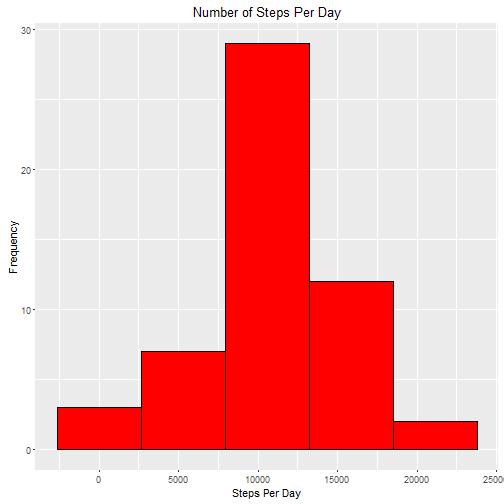
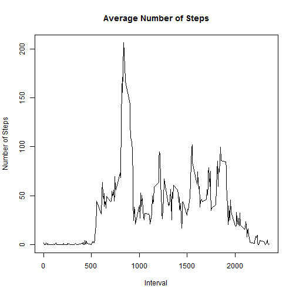
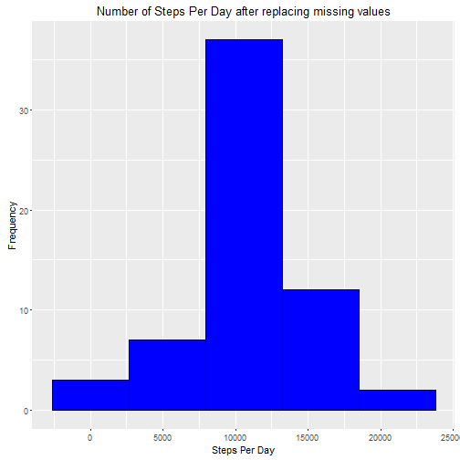
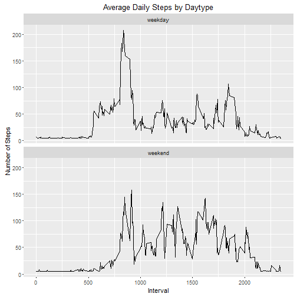

#Reproducible Research Course Project-1

###1. Reading and Processing Data:
Data is downloaded to working directory. Below code reads data into R from working directory. Missing values are omitted and this is verified using functions like nrow(), head() etc.


```r
OriginalData <- read.csv("activity.csv")
nrow(OriginalData)
```

```
## [1] 17568
```

```r
MyData <- na.omit(OriginalData)  
nrow(MyData)
```

```
## [1] 15264
```

```r
head(MyData)
```

```
##     steps       date interval
## 289     0 2012-10-02        0
## 290     0 2012-10-02        5
## 291     0 2012-10-02       10
## 292     0 2012-10-02       15
## 293     0 2012-10-02       20
## 294     0 2012-10-02       25
```

```r
summary(MyData)
```

```
##      steps                date          interval     
##  Min.   :  0.00   2012-10-02:  288   Min.   :   0.0  
##  1st Qu.:  0.00   2012-10-03:  288   1st Qu.: 588.8  
##  Median :  0.00   2012-10-04:  288   Median :1177.5  
##  Mean   : 37.38   2012-10-05:  288   Mean   :1177.5  
##  3rd Qu.: 12.00   2012-10-06:  288   3rd Qu.:1766.2  
##  Max.   :806.00   2012-10-07:  288   Max.   :2355.0  
##                   (Other)   :13536
```

###2.Histogram of the total number of steps taken each day
Below Code initially calculates total steps taken per day using aggregate function. ggplot is used to plot histogram.


```r
names(MyData)
```

```
## [1] "steps"    "date"     "interval"
```

```r
MyData$date <- as.factor(MyData$date)
StepsPerDay <- aggregate(steps ~ date, MyData, sum)
head(StepsPerDay)
```

```
##         date steps
## 1 2012-10-02   126
## 2 2012-10-03 11352
## 3 2012-10-04 12116
## 4 2012-10-05 13294
## 5 2012-10-06 15420
## 6 2012-10-07 11015
```

```r
library(ggplot2)
ggplot(StepsPerDay,aes(x = steps))+ geom_histogram(fill = "red",col=I("black"), bins = 5) + xlab("Steps Per Day") + ylab("Frequency") + ggtitle("Number of Steps Per Day")
```



###3. Mean and median number of steps taken each day


```r
MeanOfSteps <- mean(StepsPerDay$steps)
MedianOfSteps <- median(StepsPerDay$steps)
```
Mean of steps taken each day = 1.0766189 &times; 10<sup>4</sup> and Median of steps taken each day = 10765

###4.Time series plot of the average number of steps taken


```r
#typeof(MyData$date)
#head(MyData)
#MyData$date <- as.Date(MyData$date, "%d-%m%-%y")
#typeof(MyData$date)

StepsPerInterval <- aggregate(steps ~ interval, MyData, mean)
head(StepsPerInterval)
```

```
##   interval     steps
## 1        0 1.7169811
## 2        5 0.3396226
## 3       10 0.1320755
## 4       15 0.1509434
## 5       20 0.0754717
## 6       25 2.0943396
```

```r
plot(StepsPerInterval$interval,StepsPerInterval$steps,type="l", xlab="Interval", ylab="Number of Steps", main="Average Number of Steps")
```



###5.The 5-minute interval that, on average, contains the maximum number of steps
We use StepsPerInterval dataframe from above code chunk, which includes total number of steps per interval


```r
MaxVal <- StepsPerInterval[which.max(StepsPerInterval$steps),]
MaxInterval <- MaxVal[1]
```
The 5-minute interval that, on average, contains the maximum number of steps is 835


###6.Code to describe and show a strategy for imputing missing data


```r
MissingValues <- sum(is.na(OriginalData))
print(MissingValues)
```

```
## [1] 2304
```

```r
UpdatedData <- data.frame()
UpdatedData <- rbind(UpdatedData,OriginalData)
head(UpdatedData)
```

```
##   steps       date interval
## 1    NA 2012-10-01        0
## 2    NA 2012-10-01        5
## 3    NA 2012-10-01       10
## 4    NA 2012-10-01       15
## 5    NA 2012-10-01       20
## 6    NA 2012-10-01       25
```

```r
nrow(UpdatedData)
```

```
## [1] 17568
```

```r
names(UpdatedData)
```

```
## [1] "steps"    "date"     "interval"
```

```r
UpdatedData$steps[is.na(UpdatedData$steps)] = mean(UpdatedData$steps, na.rm=TRUE)
sum(is.na(UpdatedData)) # This code returns value 0 which implies missing values are replaced
```

```
## [1] 0
```

```r
head(UpdatedData)
```

```
##     steps       date interval
## 1 37.3826 2012-10-01        0
## 2 37.3826 2012-10-01        5
## 3 37.3826 2012-10-01       10
## 4 37.3826 2012-10-01       15
## 5 37.3826 2012-10-01       20
## 6 37.3826 2012-10-01       25
```

```r
###UpdatedData$steps <- ceiling(UpdatedData$steps)
nrow(UpdatedData) 
```

```
## [1] 17568
```

```r
##total number of steps taken after replacing missing values

names(UpdatedData)
```

```
## [1] "steps"    "date"     "interval"
```

```r
UpdatedData$date <- as.factor(UpdatedData$date)
StepsPerDayUpdated <- aggregate(steps ~ date, UpdatedData, sum)
head(StepsPerDayUpdated)
```

```
##         date    steps
## 1 2012-10-01 10766.19
## 2 2012-10-02   126.00
## 3 2012-10-03 11352.00
## 4 2012-10-04 12116.00
## 5 2012-10-05 13294.00
## 6 2012-10-06 15420.00
```

There are 2304 missing values. Code replaces these missing values with mean of interval.
Replacing missing values with zero indicates that there are no steps for that interval so I have considered replacing 
missing values with the mean of steps. There is slight difference in the mean number of steps after imputing missing values as we have replaced with mean of number of steps per day, which is shown in next step.


###7.Histogram of the total number of steps taken each day after missing values are imputed


```r
ggplot(StepsPerDayUpdated,aes(x = steps))+ geom_histogram(fill = "blue",col=I("black"), bins = 5) + xlab("Steps Per Day") + ylab("Frequency") + ggtitle("Number of Steps Per Day after replacing missing values")
```



```r
UpdatedMeanOfSteps <- mean(StepsPerDayUpdated$steps)
UpdatedMedianOfSteps <- median(StepsPerDayUpdated$steps)
```

Mean after imputing missing values = 1.0766189 &times; 10<sup>4</sup> and median = 1.0766189 &times; 10<sup>4</sup>

###8.Panel plot comparing the average number of steps taken per 5-minute interval across weekdays and weekends

Here, we first create dataframe WeekData same as the imputed data frame and we add variable day based on the date. We then add new 
factor variable daytype which holds values weekday or weekend based on the day.
 

```r
WeekData <- data.frame()
WeekData <- rbind(WeekData,UpdatedData)
head(WeekData)
```

```
##     steps       date interval
## 1 37.3826 2012-10-01        0
## 2 37.3826 2012-10-01        5
## 3 37.3826 2012-10-01       10
## 4 37.3826 2012-10-01       15
## 5 37.3826 2012-10-01       20
## 6 37.3826 2012-10-01       25
```

```r
WeekData$date <- as.factor(WeekData$date)
WeekData$date <- as.Date(WeekData$date, "%Y-%m-%d")
typeof(WeekData$date)
```

```
## [1] "double"
```

```r
WeekData$day <- weekdays(WeekData$date)
head(WeekData)
```

```
##     steps       date interval    day
## 1 37.3826 2012-10-01        0 Monday
## 2 37.3826 2012-10-01        5 Monday
## 3 37.3826 2012-10-01       10 Monday
## 4 37.3826 2012-10-01       15 Monday
## 5 37.3826 2012-10-01       20 Monday
## 6 37.3826 2012-10-01       25 Monday
```

```r
vector.weekdays <- c('Monday', 'Tuesday', 'Wednesday', 'Thursday', 'Friday')
WeekData$daytype <- factor(WeekData$day %in% vector.weekdays, levels = c(TRUE,FALSE), labels = c("weekday", "weekend"))
head(WeekData)
```

```
##     steps       date interval    day daytype
## 1 37.3826 2012-10-01        0 Monday weekday
## 2 37.3826 2012-10-01        5 Monday weekday
## 3 37.3826 2012-10-01       10 Monday weekday
## 4 37.3826 2012-10-01       15 Monday weekday
## 5 37.3826 2012-10-01       20 Monday weekday
## 6 37.3826 2012-10-01       25 Monday weekday
```

```r
newinterval <- aggregate(steps ~ interval + daytype, WeekData, mean)
head(newinterval)
```

```
##   interval daytype    steps
## 1        0 weekday 7.006569
## 2        5 weekday 5.384347
## 3       10 weekday 5.139902
## 4       15 weekday 5.162124
## 5       20 weekday 5.073235
## 6       25 weekday 6.295458
```

```r
levels(WeekData$daytype)
```

```
## [1] "weekday" "weekend"
```

```r
ggplot(newinterval, aes(x =interval ,y = steps), color = "blue") +
  geom_line() +
  labs(title = "Average Daily Steps by Daytype", x = "Interval", y = "Number of Steps") +
  facet_wrap(~daytype, ncol = 1, nrow=2)
```




